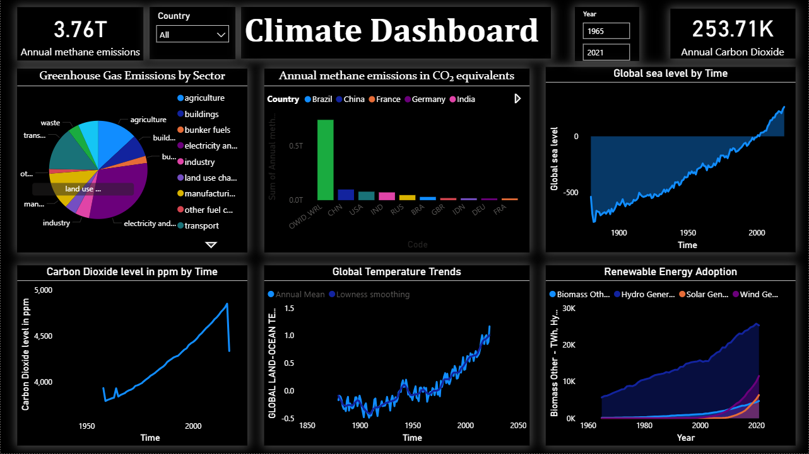
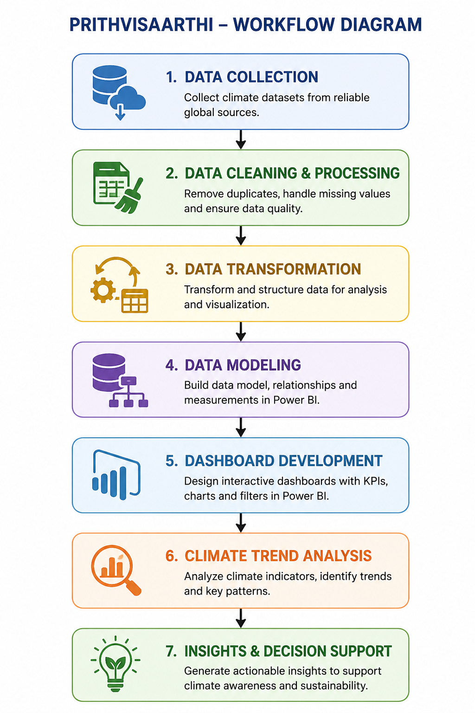

# 🌍 PrithviSaarthi - Climate Data Analytics Platform

### Transforming Climate Data into Actionable Insights Through Interactive Analytics
> 🏆 Galactic Impact Award – NASA Space Apps Challenge 2024  
> 🌍 Climate Analytics Dashboard built using Power BI and Excel




---

# 📖 Project Overview

PrithviSaarthi is a climate data analytics platform developed to analyze global environmental trends using Power BI dashboards and interactive visualizations. The project transforms complex climate datasets into meaningful insights through data-driven storytelling and visual reporting.

The dashboard focuses on greenhouse gas emissions, carbon dioxide concentration, global temperature changes, renewable energy adoption, and sea level variations to support climate awareness and sustainability discussions.

---

# 🚀 Demo

🔗 **GitHub Repository:** https://github.com/janhvi-data

🎥 **Project Demonstration Video:** https://youtu.be/02tJDMosOf4?si=29RJlfcJAX7vMeSQ

📄 **Project Documentation:** Available in the documentation folder.

---

# 🎯 Objectives

- Analyze global climate indicators over time
- Track greenhouse gas and CO₂ emission trends
- Study global temperature changes
- Monitor renewable energy adoption
- Visualize sea level variations
- Generate environmental insights through analytics

---

# 🛠️ Tools & Technologies

- Power BI
- Microsoft Excel
- Data Visualization
- Business Intelligence
- Data Analytics

---

# 📊 Dashboard Features

- Greenhouse Gas Emission Analysis
- Carbon Dioxide Trend Analysis
- Global Temperature Monitoring
- Renewable Energy Adoption Tracking
- Sea Level Change Analysis
- Interactive Filters and KPI Cards
- Country-wise Climate Comparison

---

# 📈 Key KPIs

- Annual Methane Emissions
- Carbon Dioxide Levels
- Global Temperature Change
- Renewable Energy Growth
- Sea Level Variations
- Greenhouse Gas Emission Indicators

---

# 🔄 Workflow Diagram



---

# 💡 Key Insights

- Carbon dioxide concentration has shown a consistent increase over time.
- Global temperatures indicate a long-term warming trend.
- Renewable energy adoption has grown significantly in recent years.
- Greenhouse gas emissions continue to impact climate conditions.
- Sea levels show gradual growth across historical records.

---

# 🖼️ Dashboard Preview

## Climate Analytics Dashboard


---

# 🏆 Recognition

## NASA Space Apps Challenge

- Galactic Impact Award – NASA Space Apps Challenge 2024
- Local Winner & Global Nominee 2025

---

# 📂 Repository Structure

```text
prithvisaarthi-climate-analytics/
│
├── data/
├── dashboard/
│   └── PrithviSaarthi_Climate_Dashboard.pbix
│
├── images/
│   ├── climate-dashboard.png
│   └── workflow-diagram.png
│
├── documentation/
│   ├── Project_Report.pdf
│   ├── Dashboard_Explanation.docx
│   └── Project_Summary.md
│
├── README.md
└── LICENSE
```

---

# 📚 Documentation

The documentation folder contains:

- Project Report
- Dashboard Explanation
- Project Summary

---

# 🚀 Future Enhancements

- Real-time climate data integration
- Predictive climate forecasting
- AI-based anomaly detection
- Advanced geospatial analysis
- Sustainability recommendation system

---

# 🌱 Conclusion

PrithviSaarthi demonstrates how analytics and visualization can simplify climate data and support environmental awareness. By combining multiple climate indicators into a single interactive dashboard, the project enables users to explore trends, identify patterns, and gain meaningful insights into global environmental changes.

---

# 👩‍💻 Author

**Janhvi Mishra**

Aspiring Data Analyst passionate about Data Analytics, Business Intelligence, and Data Visualization.

### Connect With Me

- LinkedIn: https://linkedin.com/in/janhvi-mishra-4ab72328a
- GitHub: https://github.com/janhvi-mishra-data
